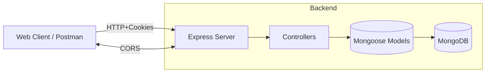

# Architecture Overview



## Modules
- **Auth**: pre-signup, signup, signin, signout, forgot/reset password, JWT cookie
- **User**: profile read/update, photos, profile resume JSON

## Repo Structure
```
src/
  config/db.js
  server.js
  models/user.js
  controllers/
    auth.js
    user.js
  routes/
    auth.js
    user.js
  validators/
    index.js
    auth.js
  helpers/dbErrorHandler.js
documents/
  openapi.yaml
  docs/
  postman/
```
